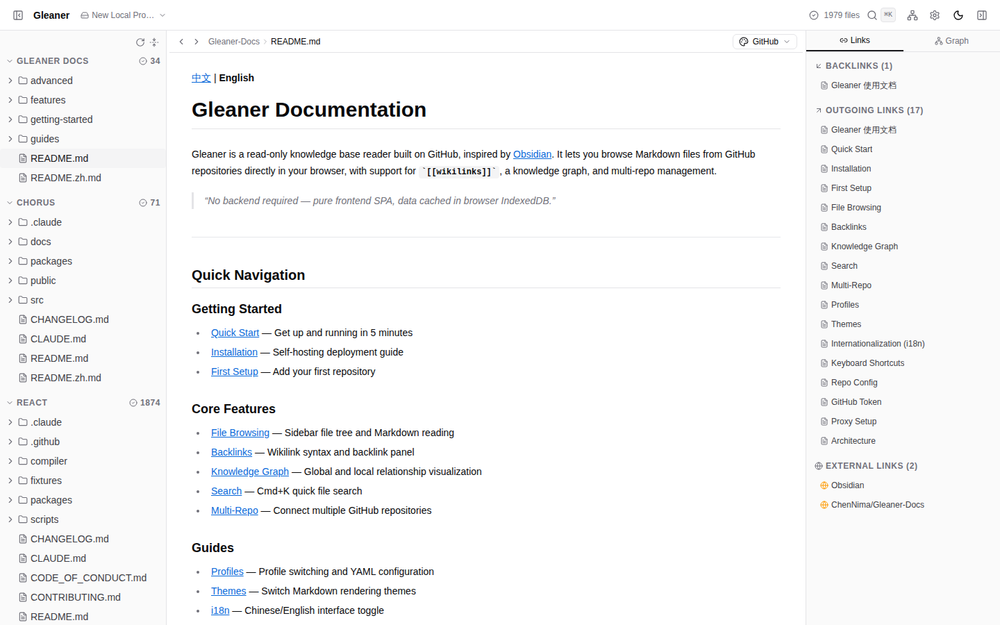
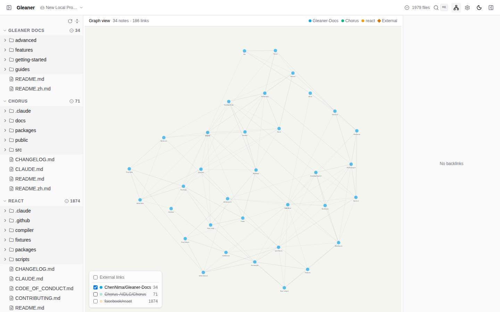
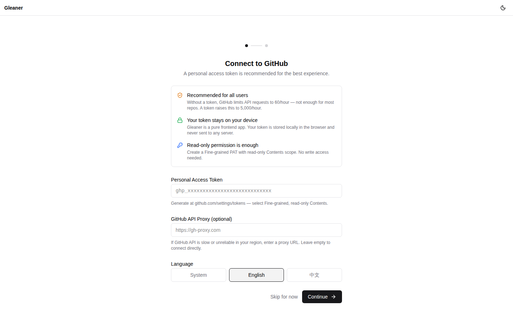

[中文](./README.zh.md) | **English**

# Gleaner

A read-only knowledge base reader that turns GitHub repositories into an Obsidian-like browsing experience — directly in your browser.



## Features

- **Markdown rendering** — GFM, code highlighting, inline HTML, `<video>` support
- **`[[Wikilinks]]`** — Bidirectional links with backlink tracking and cross-repo resolution
- **Knowledge graph** — Interactive force-directed visualization of note relationships
- **Cmd+K search** — Instant full-text search across all cached files
- **Multi-repo** — Aggregate multiple GitHub repositories into a single reading interface
- **Profiles** — Switch between different repo configurations (local YAML or GitHub-hosted)
- **Advanced repo config** — Branch selection, commit pinning, include/exclude path filters
- **Offline capable** — Content cached in IndexedDB, reads work without network
- **i18n** — English and Chinese interface
- **Dark mode** — System-aware theme with 5 document styles (GitHub, Obsidian, Academic, Notion, Newsprint)
- **GitHub API proxy** — Configurable proxy for regions with restricted access
- **Pure frontend** — No backend, no server, no data leaves your browser



## Quick Start

Visit a deployed instance, or run locally:

```bash
git clone https://github.com/ChenNima/Gleaner.git
cd Gleaner
pnpm install
pnpm run dev
```

The onboarding wizard walks you through token setup and repo configuration.



## Configuration

Repositories are configured through a `gleaner.yaml` file:

```yaml
repos:
  - url: ChenNima/Gleaner-Docs
    label: Gleaner Docs
  - url: my-org/wiki
    label: Team Wiki
    branch: develop
    commit: pin
    includePaths:
      - docs/
    excludePaths:
      - docs/drafts/
```

See the [documentation](https://github.com/ChenNima/Gleaner-Docs) for details.

## Tech Stack

Vite + React 19 + TypeScript · Zustand · IndexedDB (Dexie.js) · Tailwind CSS 4 + shadcn/ui · unified (remark/rehype) · react-force-graph-2d · Playwright

## Built With

This project was built with [Claude Code](https://claude.ai/claude-code) and [Chorus](https://chorus-ai.dev/).

## License

MIT
